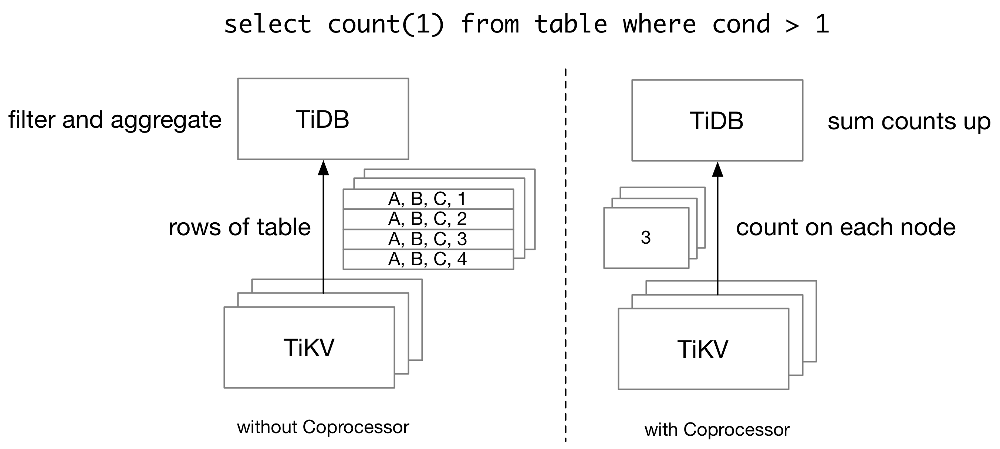
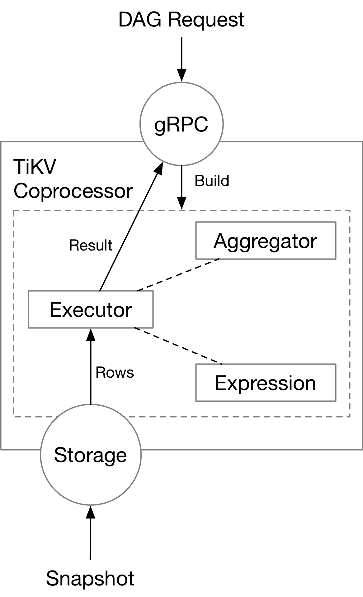

# TiKV Coprocessor

## Why Coprocessor?

TiKV is the distributed key-value storage engine made for TiDB. When TiDB executes a query, basically, it will need to retrieve and scan full rows from TiKV. Consider the following query: 



Without something like the TiKV coprocessor, TiDB will need to retrieve all rows from TiKV, then scan and filter them on the TiDB side, even if we only have a single number as the query result. In order to reduce the network traffic for a query, TiDB pushes some execution down to TiKV Coprocessor, which runs queries on the TiKV side.

A TiKV cluster is composed of multiple TiKV nodes, and thus TiKV coprocessor cannot run all queries which TiDB supports. On one side, TiKV itself only holds part of the data which a query needs. Therefore, for an aggregation query, each TiKV node can only calculate partial sums, and TiDB needs to aggregate the partial sums into the final sum. On the other side, TiKV Coprocessor only supports a limited number of executors. Complex operations like join cannot be done on TiKV.

In this article, we will introduce the basics of TiKV Coprocessor from a developer's perspective.

## Overview of TiKV Coprocessor

The TiKV Coprocessor is able to handle multiple kinds of requests. Previously, we mentioned "push-down execution". This is handled by DAG handler in the TiKV Coprocessor. The Coprocessor also supports Checksum and Analyze requests. At the same time, the TiKV Coprocessor is not limited to TiDB queries. In Coprocessor v2, developers can dynamically load Coprocessor plugins into a TiKV node, which could process any execution requests that need access to key-value data stored on the TiKV side.

The code for the TiKV Coprocessor is stored in [src/coprocessor](https://github.com/tikv/tikv/tree/master/src/coprocessor) directory. And folders begin with `tidb_query_` in [components](https://github.com/tikv/tikv/tree/master/components) is used by TiKV Coprocessor to run TiDB queries.

Here we focus on DAG handler in the TiKV Coprocessor. Running queries on the TiKV side requires two things: a plan to run query, and the data needed by a query.


For a single query, TiDB will send the plan down to TiKV (the control flow), and TiKV will scan rows of table from the local storage engine (the data flow). TiKV Coprocessor executes the plan with data from the local storage engine, and sends the result back to TiDB.

The plan and the data exist in different forms throughout the query execution process. In the following parts, we will focus on how they exist on TiKV in each stage.

## The Plan

When TiDB needs to run a query on TiKV Coprocessor, it will encode the plan in the form of protobuf messages. The schema of the query plan itself is defined in [tipb](https://github.com/pingcap/tipb) repository. Inside tipb, we have all SQL expression supported by TiKV (and TiDB), each with a unique ID, and we define components used by a query, like executors and aggregators.

The plan is then sent to the gRPC service on the TiKV side, which requires another protobuf schema definition. The definition for that is in the [kvproto](https://github.com/pingcap/kvproto/blob/master/proto/coprocessor.proto) repository. The plan is encoded in the `data` field of the request. Each Coprocessor request will specify the key range (or region) to operate on.

```protobuf
message Request {
    kvrpcpb.Context context = 1;
    int64 tp = 2;
    bytes data = 3;
    uint64 start_ts = 7;
    repeated KeyRange ranges = 4;
		// ...
}
```

As a developer, you may want to see what plan is pushed down to TiKV when running a query. This could be easily done with an SQL `explain` statement.


```plain
MySQL [test]> explain select count(*) from test where x > 10;
+-----------------------------+---------+-----------+---------------+-------------------------------------------------+
| id                          | estRows | task      | access object | operator info                                   |
+-----------------------------+---------+-----------+---------------+-------------------------------------------------+
| StreamAgg_17                | 1.00    | root      |               | funcs:count(Column#4)->Column#2                 |
| └─TableReader_18            | 1.00    | root      |               | data:StreamAgg_9                                |
|   └─StreamAgg_9             | 1.00    | cop[tikv] |               | funcs:count(1)->Column#4                        |
|     └─TableRangeScan_16     | 3333.33 | cop[tikv] | table:test    | range:(10,+inf], keep order:false, stats:pseudo |
+-----------------------------+---------+-----------+---------------+-------------------------------------------------+
4 rows in set (0.002 sec)
```

A push-down plan is marked as `cop[tikv]` in the `task` column.

## The Data

### On-Disk Format

TiKV stores its data by rows in its local KV storage engine (as of now, RocksDB or TitanDB). Upon the local KV storage engine, there is a MVCC transactional layer, called TxnKV, which Coprocessor reads data from. The key in TxnKV is composed of the table information and the primary key of a row. And other columns of this row is stored as the value in storage engine. For example,

```plain
t10_r1 --> ["TiDB", "SQL Layer", 10]
t10_r2 --> ["TiKV", "KV Engine", 20]
t10_r3 --> ["PD", "Manager", 30]
```

The TiDB row format (v2) is described in the [A new storage row format for efficient decoding](https://github.com/pingcap/tidb/blob/master/docs/design/2018-07-19-row-format.md) RFC.

### In-memory Format

The executors (will be introduced later) will scan the data from  TxnKV in small batches, and store them in memory. Contrary to the on-disk format, data are stored in a columnar way in memory. The memory format is called "Chunk format" in TiDB, and is in some way very similar to the Apache Arrow format. The implementation details are described in the [Using chunk format in coprocessor framework](https://github.com/tikv/rfcs/blob/master/text/0043-copr-chunk.md) RFC, and [this slide](https://docs.google.com/presentation/d/1fUQTJ6gEscHUag9OhIIePL9uiIYJ61TSpfor-pajBoE/edit#slide=id.g446c4deb4d_0_341). The format is implemented in [components/tidb_query_datatype](https://github.com/tikv/tikv/tree/master/components/tidb_query_datatype/src/codec/data_type) beginning with `chunked_vec_`.

## Inside Coprocessor



### Executors


### Aggregators

### Expression Framework

#### auto vectorization

#### RPN function

### Other Functionalities

#### Coprocessor v2

#### Analyze Request